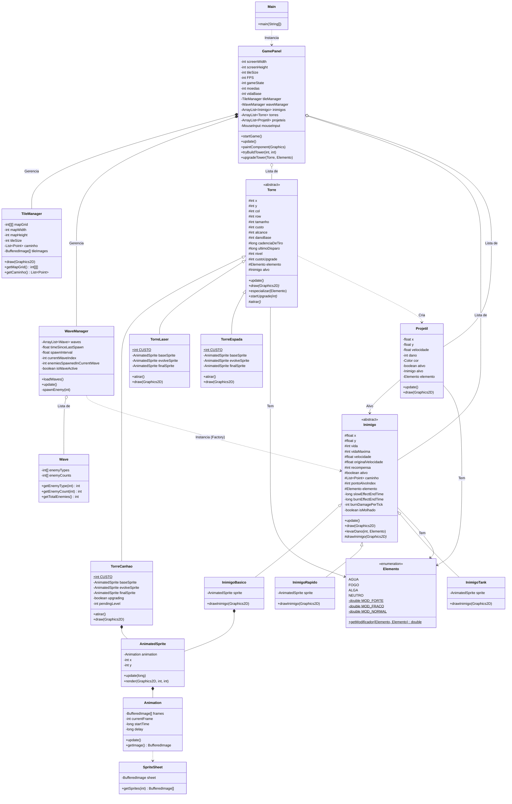

# 🦈 Tubarões vs Orcas - Tower Defense 2D

Um jogo **Tower Defense 2D** temático onde tubarões enfrentam orcas em batalhas aquáticas.

---

## 🚀 Como Executar o Projeto

### 1. Pré-requisitos
- [Java JDK 17+](https://www.oracle.com/java/technologies/javase-jdk17-downloads.html) instalado  
- Um editor ou IDE (recomendado: [IntelliJ IDEA](https://www.jetbrains.com/idea/)) ou apenas terminal  

### 2. Clonar o repositório
```bash
git clone https://github.com/seu-usuario/seu-repositorio.git
cd seu-repositorio
```
3. Compilar o código

No terminal, dentro da pasta onde estão os arquivos .java, rode:
```bash
javac Main.java GamePanel.java TileManager.java Inimigo.java e todos os outros arquivos...
```
4. Executar o jogo

Agora execute o programa principal:
```bash
java Main
```

🎨 Justificativa de Design

Visão Geral do Sistema

Este projeto implementa um jogo de Tower Defense com sistema elemental, onde o jogador posiciona torres estrategicamente para defender sua base contra ondas de inimigos. O design foi estruturado para promover estratégia profunda, escalabilidade e manutenibilidade.
Princípios de Design Aplicados

// Arquitetura modularizada:
GamePanel      → Lógica principal e UI
WaveManager    → Gerenciamento de ondas
TileManager    → Mapa e caminhos
Entity classes → Comportamento de entidades
Elemento Enum  → Regras do sistema elemental


5. Sistema de Componentes para Efeitos

    Status Effects (queimadura, lentidão, molhado) implementados como estado na classe base Inimigo

    Benefício: Efeitos podem ser combinados e interagem entre si de forma previsível

Decisões de Design Principais
Sistema Elemental Triádico
java

// Pedra-Papel-Tesoura balanceado:
AGUA > FOGO > ALGA > AGUA

    Combos: Estado "Molhado" permite interações especiais (vaporização, super crescimento)

    Modificadores: 2.0x (forte), 0.5x (fraco), 1.0x (normal)

    Efeitos Únicos: Cada elemento aplica status effects distintos

Sistema de Upgrade de Torres
java

// Design de especialização:
Nível 1: Torre básica (NEUTRO)
Nível 2: Escolha elemental (FOGO/AGUA/ALGA) + bônus

    Custo progressivo: Incentiva planejamento econômico

    Diferenciação estratégica: Cada elemento serve a propósito tático diferente

Gerenciamento de Ondas Baseado em Dados

    Wave Manager separa configuração de ondas da lógica de spawn

    List-based spawning: Fácil criação de novas ondas via código

    Cooldown dinâmico: Inimigos rápidos spawnam mais rápido


Game Loop Clássico
java

public void run() {
    while (gameThread != null) {
        update();
        repaint();
        // ... controle de FPS
    }
}

Gerenciamento de Estado do Jogo
java

ESTADO_PREPARAÇÃO → ESTADO_JOGANDO → ESTADO_FIM_DE_JOGO/ESTADO_VITORIA

    Transições claras: Interface adapta-se ao estado atual

    Fluxo controlado: Impede ações inválidas durante estados específicos

Decisões Técnicas Notáveis
Targeting

    Nearest-target: Torres priorizam inimigos mais próximos

    Projectile homing: Projéteis seguem alvos em movimento

Sistema de Economia

    Recompensa por eliminação: Incentiva eficiência

    Custo de oportunidade: Upgrade vs. novas torres

    Reembolso parcial: Venda retorna 50% do investimento

Renderização e UI

    Range indicators: Visualização de alcance das torres

    HUD contextual: Mostra opções relevantes ao estado atual

Extensibilidade e Manutenibilidade
Pontos de Extensão Fáceis

    Novos Inimigos: Estender classe Inimigo + adicionar ao WaveManager

    Novas Torres: Estender classe Torre + adicionar à HUD

    Novos Elementos: Adicionar ao enum Elemento + regras de modificador

    Novos Mapas: Modificar TileManager.criarMapaFixo()

Tratamento de Erros Robusto
java

// Em Elemento.getModificador():
if (atacante == null || defensor == null || ...) {
    return MOD_NORMAL; // Previne NullPointerException
}

Logging para Debug

    Mensagens console para combos elementais

    Avisos para elementos não definidos

Conclusão

Este design demonstra uma arquitetura bem pensada que equilibra complexidade de recursos com código de facil manutenção. O sistema elemental adiciona profundidade estratégica sem sobrecarregar o jogador, enquanto a estrutura orientada a objetos permite facilidade em expandir. A separação clara de responsabilidades entre as classes garante que modificações em uma área tenham impacto mínimo nas outras.


---

## Diagrama de Classes UML

# 🏰 Tower Defense - Tubarões Vs Orcas

## 📊 Diagrama de Arquitetura



## 🏗️ Estrutura do Projeto

```
flowchart TD
    subgraph main [src/main/]
        M1[Main.java | Ponto de entrada da aplicação]
    end

    subgraph game [src/game/]
        G1[GamePanel.java | Loop principal e Controlador (60 FPS)]
        G2[Elemento.java | Sistema elemental (Fogo > Alga > Água > Fogo)]
        G3[WaveManager.java | Gerenciador de ondas e spawn de inimigos]
        G4[Wave.java | Configuração de tipos e quantidades por onda]
    end

    subgraph entity [src/entity/]
        E1[Torre.java | Classe base com targeting e upgrade system]
        E2[TorreCanhao.java | Tipo: Balanceada (Alcance/Dano Médios)]
        E3[TorreLaser.java | Tipo: Alto Dano (Cadência Lenta)]
        E4[TorreEspada.java | Tipo: Rápida (Cadência Alta, Dano Baixo)]
        E5[Inimigo.java | Classe base com sistema de status effects (Molhado/Queimadura/Lentidão)]
        E6[InimigoBasico.java | Tipo: Básico (Elemento Fogo)]
        E7[InimigoRapido.java | Tipo: Rápido (Elemento Alga)]
        E8[InimigoTank.java | Tipo: Tank (Elemento Água)]
        E9[Projetil.java | Projéteis com mira (homing) e elemento de ataque]
    end

    subgraph map [src/map/]
        P1[TileManager.java | Mapa fixo com caminho pré-definido (Gerencia tiles)]
    end
    
    subgraph sprites [src/sprites/]
        R1[SpriteSheet.java | Utilitário para cortar imagens em frames]
        R2[Animation.java | Lógica de avanço de frames baseada no tempo]
        R3[AnimatedSprite.java | Wrapper de animação para entidades (Torre/Inimigo)]
        R4[AnimatedTile.java | Otimização de animação para tiles de mapa (Água)]
    end
    
    % Conexões representando o fluxo de dependência central
    M1 --> G1
    G1 --> G3
    G1 --> P1
    G1 --> E1
    G1 --> E5
    G3 --> G4
    E1 --> E5 & E9
    E5 --> G2
    E9 --> G2
    R3 --> R2
    R4 --> R3
    R2 --> R1
```

